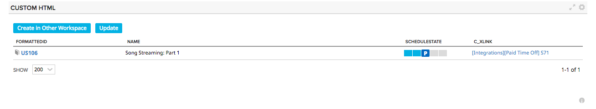

#Cross-Workspace Tracker

Allows users to make a copy of a story in a different workspace and project.
A link will be created between the source and destination stories (in the selected link field).
Fields that are copied are Name, Description, PlanEstimate and Schedule state.

The grid of the app lists all stories that have been linked to external stories in the current project scope.
Clicking Update, will update the Name, Description, PlanEstimate and ScheduleState fields.

If the selected link ID field is already populated, the story will not be available in the list of stories to copy.

The selected Link ID field must be present in the source workspace and the destination workspace.  

The user must have editor permissions to both the source and destination workspaces.  

Steps to get started:
(1) Using the App Settings, select a Link Field.  This should be a string field that is not being used for anything else and it should exist in both the source and destination workspaces.
(2) You will see an empty grid.  This grid shows the list of stories that have been copied to other workspaces.  
(3) Click Create in Other Worksapce to select a story to create in another workspace 
(4) You will only be able to copy stories that do not have a Link ID populated.  Select a story and click "Done".
(5) The story will be copied to the selected workspace and project.  
(6) Go to the story in the destination workspace and update the Name and Schedule State
(7) Return to the App and click "Update".  The name and schedule state of the story in the current workspace will be updated so that it is synced with the destination story.  

 
  

## Development Notes

### First Load

If you've just downloaded this from github and you want to do development, 
you're going to need to have these installed:

 * node.js
 * grunt-cli
 * grunt-init
 
Since you're getting this from github, we assume you have the command line
version of git also installed.  If not, go get git.

If you have those three installed, just type this in the root directory here
to get set up to develop:

  npm install

### Structure

  * src/javascript:  All the JS files saved here will be compiled into the 
  target html file
  * src/style: All of the stylesheets saved here will be compiled into the 
  target html file
  * test/fast: Fast jasmine tests go here.  There should also be a helper 
  file that is loaded first for creating mocks and doing other shortcuts
  (fastHelper.js) **Tests should be in a file named <something>-spec.js**
  * test/slow: Slow jasmine tests go here.  There should also be a helper
  file that is loaded first for creating mocks and doing other shortcuts 
  (slowHelper.js) **Tests should be in a file named <something>-spec.js**
  * templates: This is where templates that are used to create the production
  and debug html files live.  The advantage of using these templates is that
  you can configure the behavior of the html around the JS.
  * config.json: This file contains the configuration settings necessary to
  create the debug and production html files.  Server is only used for debug,
  name, className and sdk are used for both.
  * package.json: This file lists the dependencies for grunt
  * auth.json: This file should NOT be checked in.  Create this to run the
  slow test specs.  It should look like:
    {
        "username":"you@company.com",
        "password":"secret"
    }
  
### Usage of the grunt file
####Tasks
    
##### grunt debug

Use grunt debug to create the debug html file.  You only need to run this when you have added new files to
the src directories.

##### grunt build

Use grunt build to create the production html file.  We still have to copy the html file to a panel to test.

##### grunt test-fast

Use grunt test-fast to run the Jasmine tests in the fast directory.  Typically, the tests in the fast 
directory are more pure unit tests and do not need to connect to Rally.

##### grunt test-slow

Use grunt test-slow to run the Jasmine tests in the slow directory.  Typically, the tests in the slow
directory are more like integration tests in that they require connecting to Rally and interacting with
data.
